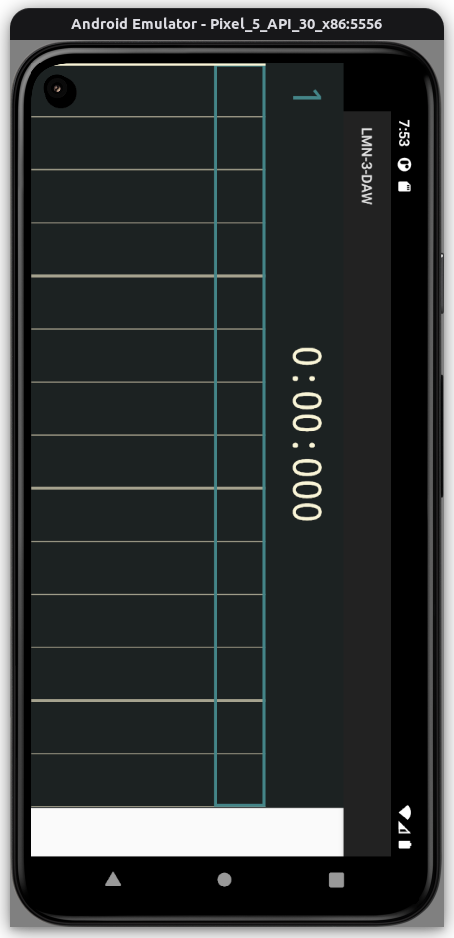

(experimental build for Android, do not expect development here.)

SplashScreen is disabled. It seems that AndroidComponentPeer is not ready
when splash screen is being shown (JUCE issue).

Tracksion hits some limitation on non-RT primitives on Android at PlayHead
(patch included).

## Building

- cd external/LMN-3-DAW && patch -i ../../lmn-3-daw-android.patch -p1 && cd ../..
- cd external/LMN-3-DAW/tracktion && patch -i ../../../tracktion-android.patch -p1 && cd ../../..
- ./gradlew build (or just launch Android Studio, open this directory and run)

